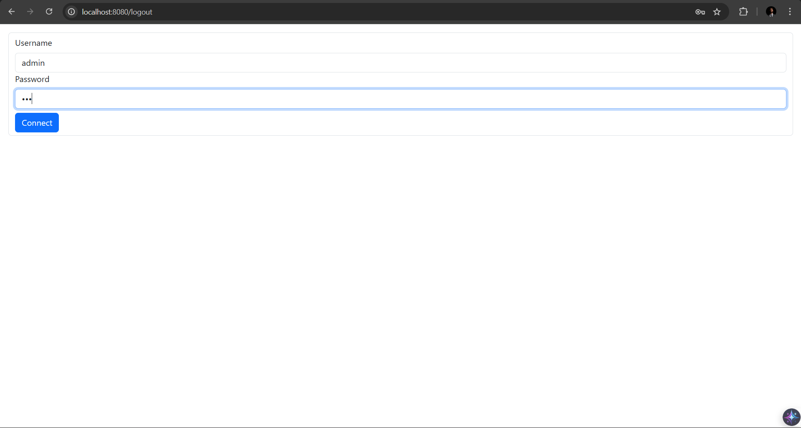
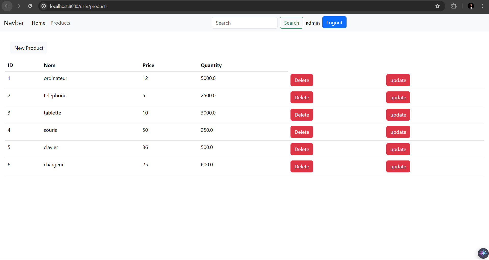
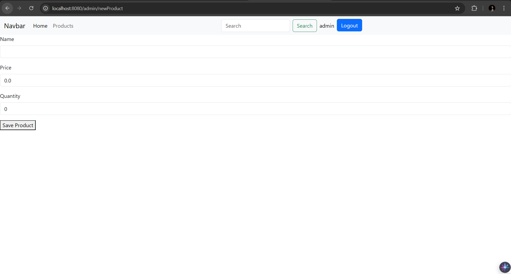
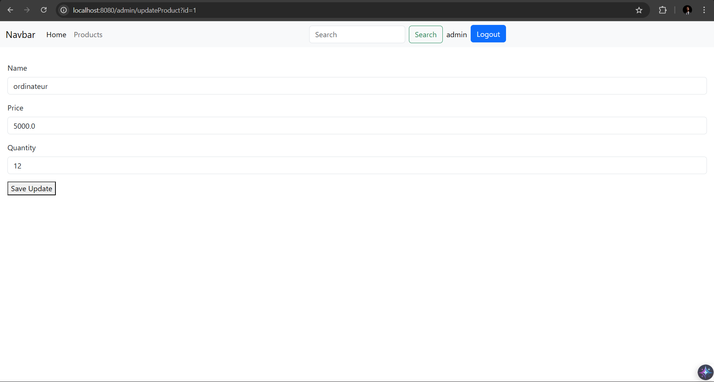

# Spring MVC Security & JPA Laboratory

A comprehensive exploration of the Spring Boot ecosystem, focused on building a secure, multi-tier web application for product lifecycle management. This project serves as a technical deep-dive into Spring Security's authorization engine and Spring Data JPA's persistence layer.

## Project Architecture

The application implements a classic MVC (Model-View-Controller) architecture with a clear separation of concerns:

1.  **View Tier**: Server-side rendering using **Thymeleaf** and **Bootstrap 5** for dynamic, responsive interfaces.
2.  **Controller Tier**: Spring MVC REST-style controllers handling request mapping and data flow.
3.  **Service/Persistence Tier**: **Spring Data JPA** managing relational data mapping to an H2 in-memory database.
4.  **Security Tier**: **Spring Security** filter chain managing session-based authentication and role-based access.

---

## Technical Stack

*   **Framework**: Spring Boot 3
*   **Security**: Spring Security (Role-Based Access Control)
*   **Persistence**: Spring Data JPA / Hibernate
*   **Database**: H2 In-Memory (Development) / MySQL (Production Ready)
*   **Templating**: Thymeleaf / Thymeleaf Layout Dialect
*   **Frontend**: Bootstrap 5
*   **Build Tool**: Maven

---

## Interface Showcase

| Login Portal | Product Management |
| --- | --- |
|  |  |

| Creation Workflow | Modification Workflow |
| --- | --- |
|  |  |

---

## Core Implementations

### 1. Robust Security Configuration
*   **Stateless vs. Session**: Implements secure session management for server-side rendered templates.
*   **RBAC (Role-Based Access Control)**: 
    *   `USER`: Authorized for read-only catalog access.
    *   `ADMIN`: Full administrative privileges for CRUD operations.
*   **Endpoint Protection**: Granular request matching using `HttpSecurity` configurations.

### 2. Relational Data Mapping (JPA)
*   **Bean Validation**: Integration of JSR-303/JSR-380 (`@NotEmpty`, `@Size`, `@Min`) at the entity level to ensure data integrity.
*   **Pagination & Sorting**: High-performance catalog browsing implemented via Spring Data's `PagingAndSortingRepository`.
*   **Automated Schema Generation**: Leveraging Hibernate's DDL-auto features for rapid prototyping.

### 3. Dynamic UI Rendering
*   **Thymeleaf Fragments**: Modular UI design using layout dialects for consistent header/footer management.
*   **Reactive Templates**: Dynamic path resolution using Thymeleaf's `@` syntax to prevent broken asset links across nested routes.

---

## Project Structure

```text
├── src/main/java/com/youssef/springweb/
│   ├── entities/      # JPA Entity definitions
│   ├── repositories/  # Spring Data JPA interfaces
│   ├── security/      # Spring Security configurations
│   └── web/           # Spring MVC Controllers
├── src/main/resources/
│   ├── templates/     # Thymeleaf HTML views
│   └── application.properties # System configuration
└── pom.xml            # Dependency management
```

---

## Deployment & Setup

### Prerequisites
*   Java 17 (OpenJDK)
*   Maven 3.8+

### Launch Sequence
1.  **Clone the repository**:
    ```bash
    git clone git@github.com:yss-ef/mvc-security-jpa-lab.git
    ```
2.  **Run the application**:
    ```bash
    mvn spring-boot:run
    ```
3.  **Access the System**:
    *   **App**: `http://localhost:8080`
    *   **H2 Console**: `http://localhost:8080/h2-console`

---

*Authored by Youssef Fellah.*

*Developed for the Engineering Cycle - Mundiapolis University.*
