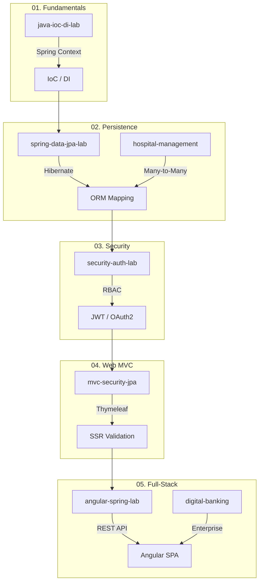

# Spring Boot Portfolio

A comprehensive collection of Spring Boot and Java projects, ranging from core fundamentals to complex enterprise-grade systems. This portfolio demonstrates mastery in IoC/DI, JPA persistence, Spring Security, and modern full-stack integration.

## Learning Progression & Roadmap



## Repository Roadmap

### 01. Fundamentals
- **[java-ioc-di-lab](./01-fundamentals/java-ioc-di-lab)**: Deep dive into Inversion of Control (IoC) and Dependency Injection (DI). Explores the transition from tight coupling to dynamic configuration using Spring Context (XML and Annotations).

### 02. Persistence & JPA
- **[spring-data-jpa-lab](./02-persistence-jpa/spring-data-jpa-lab)**: Introduction to Spring Data JPA and Hibernate. Covers entity mapping, repository patterns, and automatic schema generation.
- **[spring-jpa-hospital-management](./02-persistence-jpa/spring-jpa-hospital-management)**: A practical application of JPA for a Hospital Management System, featuring complex ORM mappings and bidirectional relationships.

### 03. Security & Authentication
- **[spring-jpa-security-auth-lab](./03-security-auth/spring-jpa-security-auth-lab)**: Foundation for Spring Security. Demonstrates User-Role management with Many-to-Many relationships and dynamic privilege assignment.

### 04. Web MVC
- **[mvc-security-jpa-lab](./04-web-mvc/mvc-security-jpa-lab)**: Traditional Spring Boot MVC application using Thymeleaf, featuring JDBC/JPA security persistence and form validation.

### 05. Full-Stack Systems
- **[angular-spring-lab](./05-fullstack-systems/angular-spring-lab)**: Integration of a Spring Boot 3 REST API with an Angular 17 frontend for product management.
- **[digital-banking-system](./05-fullstack-systems/digital-banking-system)**: A comprehensive enterprise-grade banking solution featuring JWT/OAuth2 security, financial transactions, and a rich Angular dashboard.

---

## How to Run

Each subdirectory is an independent Maven project. To run a specific project:

1. Navigate to the project directory:
   ```bash
   cd 05-fullstack-systems/digital-banking-system/backend
   ```
2. Run the Spring Boot application:
   ```bash
   ./mvnw spring-boot:run
   ```

## Port Configuration
Most projects default to port `8080`. If you wish to run multiple projects simultaneously, update the `server.port` in the respective `application.properties` files.

---
*Authored by Youssef Fellah.*
*Developed for the Engineering Cycle - Mundiapolis University.*
